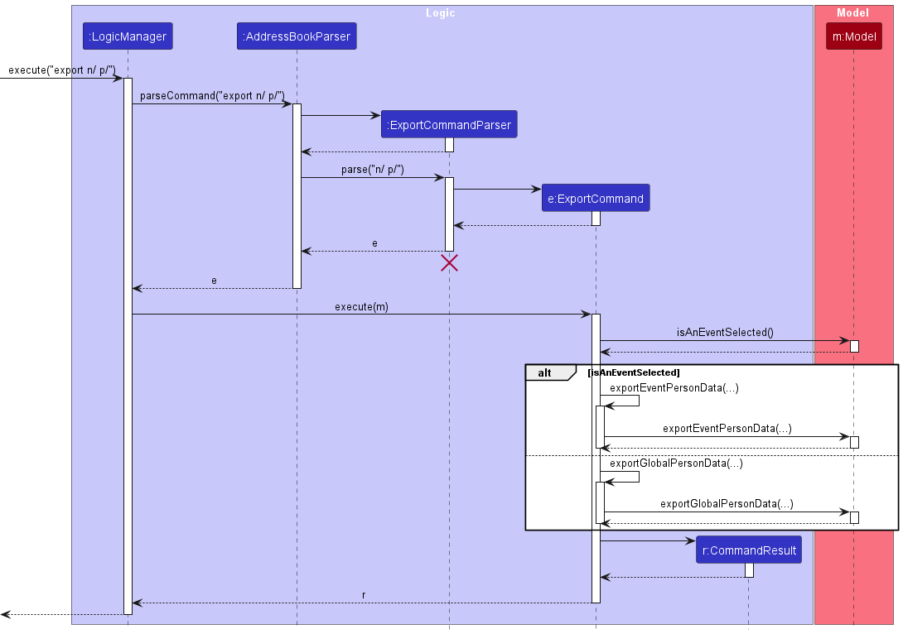

# Eventy Developer Guide

<!-- * Table of Contents -->
<page-nav-print />

--------------------------------------------------------------------------------------------------------------------

## **Acknowledgements**

_{ list here sources of all reused/adapted ideas, code, documentation, and third-party libraries -- include links to the original source as well }_

--------------------------------------------------------------------------------------------------------------------

## **Setting up, getting started**

Refer to the guide [_Setting up and getting started_](SettingUp.md).

--------------------------------------------------------------------------------------------------------------------

## **Design**

### Architecture

<puml src="diagrams/ArchitectureDiagram.puml" width="280" />

The ***Architecture Diagram*** given above explains the high-level design of the App.

Given below is a quick overview of main components and how they interact with each other.

**Main components of the architecture**

**`Main`** (consisting of classes [`Main`](https://github.com/se-edu/addressbook-level3/tree/master/src/main/java/seedu/address/Main.java) and [`MainApp`](https://github.com/se-edu/addressbook-level3/tree/master/src/main/java/seedu/address/MainApp.java)) is in charge of the app launch and shut down.
* At app launch, it initializes the other components in the correct sequence, and connects them up with each other.
* At shut down, it shuts down the other components and invokes cleanup methods where necessary.

The bulk of the app's work is done by the following four components:

* [**`UI`**](#ui-component): The UI of the App.
* [**`Logic`**](#logic-component): The command executor.
* [**`Model`**](#model-component): Holds the data of the App in memory.
* [**`Storage`**](#storage-component): Reads data from, and writes data to, the hard disk.

[**`Commons`**](#common-classes) represents a collection of classes used by multiple other components.

**How the architecture components interact with each other**

The *Sequence Diagram* below shows how the components interact with each other for the scenario where the user issues the command `addp n/David p/98987676 e/david@example.com a/NUS t/student`.

<puml src="diagrams/ArchitectureSequenceDiagram.puml" width="574" />

Each of the four main components (also shown in the diagram above),

* defines its *API* in an `interface` with the same name as the Component.
* implements its functionality using a concrete `{Component Name}Manager` class (which follows the corresponding API `interface` mentioned in the previous point.

For example, the `Logic` component defines its API in the `Logic.java` interface and implements its functionality using the `LogicManager.java` class which follows the `Logic` interface. Other components interact with a given component through its interface rather than the concrete class (reason: to prevent outside component's being coupled to the implementation of a component), as illustrated in the (partial) class diagram below.

<puml src="diagrams/ComponentManagers.puml" width="300" />

The sections below give more details of each component.

### UI component

The **API** of this component is specified in [`Ui.java`](https://github.com/se-edu/addressbook-level3/tree/master/src/main/java/seedu/address/ui/Ui.java)

<puml src="diagrams/UiClassDiagram.puml" alt="Structure of the UI Component"/>

The UI consists of a `MainWindow` that is made up of parts e.g.`CommandBox`, `ResultDisplay`, `PersonListPanel`, `StatusBarFooter` etc. All these, including the `MainWindow`, inherit from the abstract `UiPart` class which captures the commonalities between classes that represent parts of the visible GUI.

The `UI` component uses the JavaFx UI framework. The layout of these UI parts are defined in matching `.fxml` files that are in the `src/main/resources/view` folder. For example, the layout of the [`MainWindow`](https://github.com/se-edu/addressbook-level3/tree/master/src/main/java/seedu/address/ui/MainWindow.java) is specified in [`MainWindow.fxml`](https://github.com/se-edu/addressbook-level3/tree/master/src/main/resources/view/MainWindow.fxml)

The `UI` component,

* executes user commands using the `Logic` component.
* listens for changes to `Model` data so that the UI can be updated with the modified data.
* keeps a reference to the `Logic` component, because the `UI` relies on the `Logic` to execute commands.
* depends on some classes in the `Model` component, as it displays `Person` `Event` objects residing in the `Model`.

### Logic component

**API** : [`Logic.java`](https://github.com/se-edu/addressbook-level3/tree/master/src/main/java/seedu/address/logic/Logic.java)

Here's a (partial) class diagram of the `Logic` component:

<puml src="diagrams/LogicClassDiagram.puml" width="550"/>

The sequence diagram below illustrates the interactions within the `Logic` component, taking `execute("delp 1")` API call as an example.

<puml src="diagrams/DeleteParticipantSequenceDiagram.puml" alt="Interactions Inside the Logic Component for the `delete 1` Command" />

<box type="info" seamless>

**Note:** The lifeline for `DeletePersonCommandParser` should end at the destroy marker (X) but due to a limitation of PlantUML, the lifeline continues till the end of diagram.

</box>

How the `Logic` component works:

1. When `Logic` is called upon to execute a command, it is passed to an `AddressBookParser` object which in turn creates a parser that matches the command (e.g., `DeletePersonCommandParser`) and uses it to parse the command.
2. This results in a `Command` object (more precisely, an object of one of its subclasses e.g., `DeletePersonCommand`) which is executed by the `LogicManager`.
3. The command can communicate with the `Model` when it is executed (e.g. to delete a person). 

   Note that although this is shown as a single step in the diagram above (for simplicity), in the code it can take several interactions (between the command object and the `Model`) to achieve.
4. The result of the command execution is encapsulated as a `CommandResult` object which is returned back from `Logic`.

Here are the other classes in `Logic` (omitted from the class diagram above) that are used for parsing a user command:

<puml src="diagrams/ParserClasses.puml" width="600"/>

How the parsing works:
* When called upon to parse a user command, the `AddressBookParser` class creates an `XYZCommandParser` (`XYZ` is a placeholder for the specific command name e.g., `AddCommandParser`) which uses the other classes shown above to parse the user command and create a `XYZCommand` object (e.g., `AddCommand`) which the `AddressBookParser` returns back as a `Command` object.
* All `XYZCommandParser` classes (e.g., `AddCommandParser`, `DeletePersonCommandParser`, ...) inherit from the `Parser` interface so that they can be treated similarly where possible e.g, during testing.

### Model component
**API** : [`Model.java`](https://github.com/se-edu/addressbook-level3/tree/master/src/main/java/seedu/address/model/Model.java)

<puml src="diagrams/ModelClassDiagram.puml" width="450" />

The `Model` component,

* stores the address book data i.e., all `Person` objects (which are contained in a `UniquePersonList` object).
* stores the event book data i.e., all `Event` objects (which are contained in a `UniquePersonList` object)
* stores the currently 'selected' `Person` objects (e.g., results of a search query) as a separate _filtered_ person list which is exposed to outsiders as an unmodifiable `ObservableList<Person>` that can be 'observed' e.g. the UI can be bound to this list so that the UI automatically updates when the data in the list change.
* stores the currently 'selected' `Event` object (e.g., results of a select query) as a separate _filtered_ event list which is exposed to outsiders as an unmodifiable `ObservableList<Event>` that can be 'observed' e.g. the UI can be bound to this list so that the UI automatically updates when the data in the list change.
* stores a `UserPref` object that represents the user’s preferences. This is exposed to the outside as a `ReadOnlyUserPref` objects.
* does not depend on any of the other three components (as the `Model` represents data entities of the domain, they should make sense on their own without depending on other components)

<box type="info" seamless>

**Note:** An alternative (arguably, a more OOP) model is given below. It has a `Tag` list in the `AddressBook`, which `Person` references. This allows `AddressBook` to only require one `Tag` object per unique tag, instead of each `Person` needing their own `Tag` objects. 

<puml src="diagrams/BetterModelClassDiagram.puml" width="450" />

</box>

### Storage component

**API** : [`Storage.java`](https://github.com/AY2324S2-CS2103T-T10-3/tp/blob/master/src/main/java/seedu/address/storage/Storage.java)

<puml src="diagrams/StorageClassDiagram.puml" width="550" />

The `Storage` component,
* can save global participant list data, event list data, and participant list data of all added events in JSON format, and read it back into corresponding objects.
* inherits from`AddressBookStorage` `EventBook Storage` and `UserPrefStorage`, which means it can be treated as either one (if only the functionality of only one is needed).
* depends on some classes in the `Model` component (because the `Storage` component's job is to save/retrieve objects that belong to the `Model`)

### Common classes

Classes used by multiple components are in the `seedu.addressbook.commons` package.

--------------------------------------------------------------------------------------------------------------------
## **Implementation**

This section describes some noteworthy details on how certain features are implemented.

### Add Person to Global Participant List Feature

The `AddCommand` allows users to add a person to the global participant list

#### Implementation Details

The `AddCommand` is implemented by extending the base `Command` class. It uses prefixes such as `/n`, `/p`, `/a`, `/e`, `/t`, specifying
required data fields `participant name`, `phone number`, `address`, `email`, `tags` respectively. Once the data fields are filled,
a new person is added. It implements the following operations:

* `execute(Model)` — Checks the current address book state by calling `hasPerson(toAdd)`, and throws a `CommandException` if a duplicate person is found.
* `addPerson(toAdd)` — Adds the person to the global participant list. This operation is exposed in the `Model` interface as `Model#addPerson(Person)`.

The add command is initiated by firstly checking the filtered person list to ensure no duplicate is found, after which `Model#addPerson(Person)` is called to complete the actual addition.

Given below is an example usage scenario of how the addition mechanism behaves when the user tries to add a person to the global participant list.

Step 1. The user launches the application, with some events and participants added to the address book already.
The `AddressBook` will be initialized with the previously saved address book state.

Step 2. The user executes `addp` command with the specific data at each prefix to specify the person to be added.
The `AddCommand` will then call `excecute()`, which checks whether there is a duplicate person in the global participant list before calling `addPerson(Person)`.

<box type="info" seamless>

**Note:** All prefixes are compulsory to fill up except tags.

</box>

#### Sequence Diagram

<puml src="diagrams/AddPersonSequenceDiagram.puml" />

### Select Event Feature

The Select Event mechanism is a pivotal part of Eventy's functionality, serving two main purposes:

1. A number of commands within Eventy are designed to target the selected event, while some commands also have
   differing behaviours based on whether an event is selected or not:
- An example of the former is the `Invite Person to Event`</a> command,
  which adds a person to the **selected event**.
- An example of the latter is the `Delete a Person` command. If **an event is not selected**, it will delete the person
  from Eventy as a whole, else if **an event is selected**, it will delete the person only from the selected event.

<box type="info" seamless>

**Note:** For more details on how this functionality is implemented, you may refer to the developer guide documentation
for these two examples: the <a href="#Invite Person to Event"> Invite Person to Event </a> and
<a href="#delete-participant"> DeletePerson </a> commands.

</box>

2. Users of Eventy can select an event and deselect the currently selected event, using the `Selecting an event` and
   `Deselecting an event` commands respectively.

#### Implementation Details

The Select Event mechanism is facilitated by the `EventBook`, which implements `ReadOnlyEventBook`. `EventBook` serves as the
counterpart to the `AddressBook`, focusing on Event-related functionality, while `AddressBook` handles People-related
functionality.

To implement the Select Event mechanism, `EventBook` stores internally:
* `events` &thinsp;—&thinsp; The list that contains the unique events that are in Eventy.
* `selectedEvent` &thinsp;—&thinsp; The event that is currently selected. If no event is selected, it is set to `null`.
* `personsOfSelectedEvent` &thinsp;—&thinsp; The list that contains the unique people in the selected event. If no
  event is selected, it is an empty list.

Additionally, it implements the following operations (not exhaustive):
* `EventBook#isAnEventSelected()` &thinsp;—&thinsp; Returns `true` if an event is selected, else returns `false`
* `EventBook#selectEvent(Event event)` &thinsp;—&thinsp; Selects the given event
* `EventBook#deselectEvent()` &thinsp;—&thinsp; Deselect the currently selected event, if any, so that no event is
  selected

These operations are exposed to other components through `ModelManager`.

#### Sequence Diagram

In order to select an event and deselect an event, we have the `Selecting an event` command and `Deselecting an event`
command respectively. Both commands function similarly, and so we will only be explaining the `Selecting an event` command.

The following sequence diagram shows how the `Selecting an event` command works through the `Logic` component.

<box type="info" seamless>

**Note:** The lifeline for `SelectCommandParser` should end at the destroy marker (X) but due to a limitation of PlantUML, the lifeline continues till the end of diagram.

</box>

How the `Selecting an event` command works in the `Logic` component:

1. When `Logic` is called upon to execute a command, it is passed to an `AddressBookParser` object which in turn creates the `SelectCommandParser`, which is used to parse the command.
1. This results in a `SelectCommand` object, which contains the parsed value - the index of the event to select. In this example, the index is of value `1`.
1. The `SelectCommand` communicates with the `Model` when it is executed.  
   It first uses `getFilteredEventList()`, to retrieve the list of events shown to the user (`shownEventList`).
   Then, it gets the event to be selected from that list (based on the index provided by the user), then calls `selectEvent(eventToSelect)` to select that event.
1. The result of the command execution is encapsulated as a `CommandResult` object which is returned back from `Logic`.
   The result of the command execution is encapsulated as a CommandResult object which is returned back from Logic.

#### Design considerations:

**Aspect: How an event is selected:**

* **Alternative 1 (current choice):** Stores the event that is selected as a variable.
  * Pros: Easy to implement.
  * Cons: Limited Scalability, as it may be difficult to manage the selected event state solely through a variable as complexity increases.

* **Alternative 2:** Every event includes a field indicating its selection status.
  * Pros: Multiple Events can be selected at the same time, which may be useful for future expansion.
  * Cons: May have more overhead.

### Invite Person to Event Feature

The `InvitePersonCommand` allows users to invite a person to the selected event from the global address book.

#### Implementation Details

The `InvitePersonCommand` is implemented by extending the base `Command` class. It uses a `targetIndex`, specifying the desired person's global list index, to identify the person to be added to the selected event. It implements the following operations:

* `execute(Model)` — Checks the current address book state by calling `isAnEventSelected()`, and throws a `CommandException` if no event is selected.
  It also calls `isPersonInSelectedEvent` to ensure the invitee is not already added to the event by throwing a `CommandException` if he is already on the invitee list.
* `addPersonToSelectedEvent(Person)` — Adds the participant to the selected event from the filtered global participant list. This operation is exposed in the `Model` interface as `Model#addPersonToSelectedEvent(Person)`.

The invite command is initiated by firstly retrieving the filtered person list and locating the `personToInvite` object in it, after which `Model#addPersonToSelectedEvent(Person)(Person)` is called to complete the actual invitation.

Given below is an example usage scenario of how the invitation mechanism behaves when the user tries to invite a participant from the global participant list.

Step 1. The user launches the application, with some events and participants added to the address book already. The `AddressBook` will be initialized with the previously saved address book state, and the `selectedEvent` in the `EventBook` will initially be `null`.

Step 2. The user executes `sel 1` command to select the first event to be modified

Step 3. The user executes `inv 3` command to invite the 5th person in the global list to the selected event. The `InviteCommand` will then call `excecute()`, which checks that an event is selected and the user doesn't already exist in the selected event invitee list before calling `addPersonToSelectedEvent(Person)`.

<box type="info" seamless>

**Note:** If the `targetIndex` provided is invalid, a `CommandException` will be thrown.

</box>

#### Sequence Diagram

#### Design Considerations:

**Aspect 1: How to specify the event the person should be added to:**

* **Alternative 1 (current choice):** Select an event first, then use the `index` in the filtered list
    * Pros: Easier to implement.  Immediate visual reference.
    * Cons: Extra select command is needed before participant can be added

* **Alternative 2:** Specify event and person indices in one command
    * Pros: Action can be performed in one command
    * Cons: Requires more complex input parsing, makes the user input longer, and may be confusing for the user

**Rationale:**

The primary rationale for selecting an event first is it lets the user have a clear sense that a certain event is currently being modified.

This will prevent future errors where the user confuses `invite` and `add` commands.

### Delete Person Feature

The `DeletePersonCommand` allows users to delete a person either from the global address book or from a specific event, depending on whether an event is selected.

#### Implementation Details

The `DeletePersonCommand` is implemented by extending the base `Command` class. It uses a `targetIndex` to identify the person to be deleted in the filtered person list. It implements the following operations:

* `execute(Model)` — Checks the current address book state by calling `isAnEventSelected()`, and call `deleteFromGlobal` or `deleteFromEvent` accordingly.
* `deleteFromGlobal(Model)` — Deletes the participant in the filtered global participant list. This operation is exposed in the `Model` interface as `Model#deletePerson(Person)`.
* `deleteFromEvent(Model)` — Deletes the participant in the filtered selected event participant list. This operation is exposed in the `Model` interface as `deletePersonFromSelectedEvent(Person)`.

The deletion is initiated by firstly retrieving the filtered person list and locating the `personToDelete` object in it, after which `Model#deletePerson(Person)` /  `Model#deletePersonFromSelectedEvent(Person)` is called to complete the actual deletion.

Given below is an example usage scenario of how the deletion mechanism behaves when the user tries to delete a participant from the global participant list.

Step 1. The user launches the application, with some events and participants added to the address book already. The `AddressBook` will be initialized with the previously saved address book state, and the `selectedEvent` in the `EventBook` will initially be `null`.

Step 2. The user executes `delp 5` command to delete the 5th person in the address book. The `deletePersonCommand` will then call `excecute()`, which checks that no event is being selected before calling `deleteFromGlobal()`.

<box type="info" seamless>

**Note:** If the `targetIndex` provided is invalid, a `CommandException` will be thrown.

</box>

Step 3. The `deleteFromGlobal()` function calls `Model#deletePerson()` to complete the deletion, and the state of the filtered person list is thereby changed.

#### Sequence Diagram

#### Design Considerations:

**Aspect 1: How to structure the 2 Delete Participant Commands:**

* **Alternative 1 (current choice):** Same command for global and event-specific deletion
    * Pros: Shorter code. The unified `DeletePersonCommand` is easier to learn.
    * Cons: Slightly harder to implement.

* **Alternative 2:** Separate commands for global and event-specific deletion
    * Pros: Simplifies the implementation of each command.
    * Pros: Shorter code. The unified `DeletePersonCommand` is easier to learn.
    * Cons: Slightly harder to implement.

**Rationale:**
The choice to unify the deletion process under a single `DeletePersonCommand` stems from a desire to streamline the user experience and reduce the learning curve associated with the application. By minimizing the number of commands a user needs to learn, the application becomes more intuitive, especially for new or infrequent users. The unified command approach emphasizes simplicity from the user's perspective, even if it introduces additional complexity behind the scenes.

**Aspect 2: How to specify the person to be deleted:**

* **Alternative 1 (current choice):** Use the `index` in the filtered list
    * Pros: Easier to implement.  Immediate visual reference.
    * Cons: Limited by Viewport. When the participant list is long and paginated or requires scrolling, users might find it cumbersome to scroll through and find the index of the person they wish to delete.

* **Alternative 2:** Use the `name` of the participant
    * Pros: Direct and intuitive, and can avoid indexing issues.
    * Cons: Requires more complex input parsing, and makes the user input longer.

**Rationale:**
The primary rationale for using an `index` as the specifier is its simplicity and direct mapping to the user interface. Users can easily locate and specify a contact for deletion based on their position in a list, making the command straightforward to implement and understand. This approach is particularly effective in scenarios where users work with relatively short lists where the viewport limitations are minimal. In the scenario where the participant list gets longer, the user can always use the `find` command to filter out the contact they want to delete before making the actual deletion.

### Find Person Feature

The `FindCommand` allows users to find persons with specific name, tag or both from global or event participant list.

#### Implementation Details

The `FindCommand` is implemented by extending the base `Command` class. It uses `name`, `tags` or both to identify the person in the global or event participant list. It implements the following operations:

* `execute(Model)` — Checks the current address book state by calling `isAnEventSelected()`, and call `findInPersonListOfSelectedEvent` or `findInGlobalPersonList` accordingly.
* `findInPersonListOfSelectedEvent(Model)` — Finds the person in the global participant list. This operation is exposed in the `Model` interface as `Model#updateFilteredPersonListOfSelectedEvent(Predicate)`.
* `findInGlobalPersonList(Model)` — Deletes the participant in the filtered selected event participant list. This operation is exposed in the `Model` interface as `updateFilteredPersonList(Predicate)`.

The deletion is initiated by firstly testing the predicate given by the user and returning the names/tags that match, after which `Model#findInGlobalPersonList(Predicate)` /  `Model#findInPersonListOfSelectedEvent(Predicate)` is called to complete the actual find.

Given below is an example usage scenario of how the deletion mechanism behaves when the user tries to delete a participant from the global participant list.

Step 1. The user launches the application, with some events and participants added to the address book already. The `AddressBook` will be initialized with the previously saved address book state, and the `selectedEvent` in the `EventBook` will initially be `null`.

Step 2. The user executes `find n/David t/friends` command to find any matching person with the name `David` and the tag `friends` in the address book. The `FindCommand` will then call `excecute()`, which checks that no event is being selected before calling `findInGlobalPersonList(Predicate)`.

#### Sequence Diagram

<puml src="diagrams/FindPersonSequenceDiagram.puml" />

#### Design Considerations

**Aspect 1: How to structure the 2 Find Person Commands:**

* **Alternative 1 (current choice):** Same command for global and event-specific find
    * Pros: Shorter code. The unified `FindCommand` is easier to learn.
    * Cons: Implementing the predicate for both name and tag can be confusing.

* **Alternative 2:** Separate commands for global and event-specific find
    * Pros: Simplifies the implementation of each command.
    * Pros: Shorter code. The unified `FindCommand` is easier to learn.
    * Cons: Slightly harder to implement.

**Rationale:**
The choice to unify the find process under a single `FindCommand` stems from a desire to streamline the user experience
and reduce the learning curve associated with the application. By minimizing the number of commands a user needs to
learn, the application becomes more intuitive, especially for new or infrequent users. The unified command approach
emphasizes simplicity from the user's perspective, even if it introduces additional complexity behind the scenes.

**Aspect 2: How to specify the person to be deleted:**

* **Alternative 1 (current choice):** Use the `n/`, `t/` prefixes
    * Pros: Easier to implement.  Immediate visual reference.
    * Cons: Cumbersome to type all prefixes with some visual confusion. The user might find it cumbersome to type in
      each individual tag prefixes and too many prefixes may confuse the user visually.

* **Alternative 2:** Find without prefixes
    * Pros: Direct and intuitive, and can avoid indexing issues.
    * Cons: Requires more complex input parsing, and makes it more error prone.

**Rationale:**
The primary rationale for using prefixes as the specifier is its simplicity and direct reference to each person.
Users can easily locate a contact based on the user inputs, making the command straightforward to implement and
understand. This approach is particularly effective in scenarios where users work with relatively short lists where the
viewport limitations are minimal. In the scenario where the participant list gets longer, the user can always
use OR search in terms of name/tags to filter out the contacts.

### Delete Event Feature

The `DeleteEventCommand` allows users to delete an event from the event book,
depending on whether an event is selected.

#### Implementation Details

The `DeleteEventCommand` is implemented by extending the base `Command` class.
It uses a `targetIndex` to identify the event to be deleted in the filtered event list.
It implements the following operations:

* `execute(Model)`— Checks the current address book state by calling `isSameEventSelected()`, and call `deleteEvent`
* `deleteEvent(Model)` — Deletes the event in the filtered event list. This operation is exposed in the `Model` interface as `Model#deleteEvent(Event)`.

Given below is an example usage scenario and how the delete event mechanism behaves
when the user tries to delete an event from the event list.

Step 1. The user launches the application for the first time. The `EventBook` will be
initialized with the initial event book state.

Step 2. The user executes `delev 1` command to delete the 1st event in the event book.
The `delev` command calls `Model#deleteEvent()`, causing the modified state of the event book after the
`delev 1` command executes to be saved in the event book.

<box type="info" seamless>

**Note:** If the event to be deleted is currently selected,
it will not call `Model#deleteEvent()`, so there will be no state change in
the event book.

</box>

#### Sequence Diagram

<puml src="diagrams/DeleteEventSequenceDiagram.puml" />

#### Design considerations:

**Aspect: How delete event executes:**

* **Alternative 1 (current choice):** Compares event and selected event with equals.
    * Pros: Easy to implement.
    * Cons: May not be very specific.

### Export Participant Data Feature

The `ExportCommand` enables users to export the selected details of all filtered participants to a CSV file,
with the flexibility to specify which details (including Name, Phone, Email, Address) to include via command flags.
This functionality enhances data portability and allows for easy sharing and analysis of participant information outside the application.

#### Implementation Details

The `ExportCommand` extends the base `Command` class and incorporates `boolean` flags for each detail field (Name, Phone, Email, Address) that can be exported.
It uses these flags to indicate the specified details to be exported for each participant in the filtered list.
The actual export is done by a `PersonDataExporter` in the `Model` object.
The command implements the following main operations:

- `execute(Model)` — Executes the export command using the provided `model`. It checks if an event is selected and
  accordingly calls either `model.exportEventPersonData(...)` or `model.exportGlobalPersonData(...)` based on the `boolean` flags provided.
  It handles any `IOExceptions` that occur during the export process by throwing a `CommandException` with a failure message.
- `equals(Object)` — Overrides the `equals` method to allow comparison of `ExportCommand` objects, facilitating testing and debugging.

Given below is an example usage scenario of how the export mechanism behaves when the user tries to export the selected participant information.

Step 1. The user launches the application, with some events and participants added to the address book already. The `AddressBook` will be initialized with the previously saved address book state, and the `selectedEvent` in the `EventBook` will initially be `null`.

Step 2. The user executes `export n/ p/` command to export the name and phone number of all participants in the `AddressBook`. The `ExportCommand` will then call `excecute()`, which checks that no event is being selected before calling `model.exportGlobalPersonData(...)`.

#### Sequence Diagram

A sequence diagram to illustrate the `ExportCommand` execution can be conceptualized as follows:

<box type="info" seamless>

**Note:** The lifeline for `ExportCommandParser` should end at the destroy marker (X) but due to a limitation of PlantUML, the lifeline continues till the end of the diagram.

</box>

#### Design Considerations

**Aspect 1: Data export scope selection**

* **Alternative 1 (current choice):** Export based on the selection state (event-specific or global)
    * Pros: Provides flexibility, allowing users to export data in the context they are currently working in (either globally or for a specific event).
    * Cons: Users must be aware of the current context and may inadvertently export the wrong set of data if not careful.

* **Alternative 2:** Require explicit specification of the export scope within the command
    * Pros: Reduces the chance of user error by requiring explicit instruction on what to export.
    * Cons: Increases command complexity and length, potentially confusing users or leading to longer input times.

**Rationale:**
The chosen design leverages the application's context (whether an event is selected) to determine the scope of the export.
This approach simplifies the command syntax and aligns with the user's current focus within the application,
providing an intuitive and streamlined experience.

**Aspect 2: Selection of participant details for export**

* **Alternative 1 (current choice):** Use command flags to specify details to export
    * Pros: Offers customization for the export process, allowing users to export only the information they need.
    * Cons: Increases the complexity of the command, requiring users to remember and use specific flags.

* **Alternative 2:** Export all details by default
    * Pros: Simplifies the command, making it easier for users to export data without worrying about flags.
    * Cons: Lacks flexibility, as users may end up exporting more information than needed, leading to potential privacy concerns or unwieldy CSV files.

**Rationale:**
The flexibility offered by allowing users to specify which details to export caters to various needs and scenarios,
such as when only specific types of information (e.g., contact details) are required for a particular task or analysis.
This design decision places control in the hands of the user, ensuring the export functionality remains versatile and adaptable to different use cases.

--------------------------------------------------------------------------------------------------------------------

## **Documentation, logging, testing, configuration, dev-ops**

* [Documentation guide](Documentation.md)
* [Testing guide](Testing.md)
* [Logging guide](Logging.md)
* [Configuration guide](Configuration.md)
* [DevOps guide](DevOps.md)

--------------------------------------------------------------------------------------------------------------------

## **Appendix: Requirements**

### Product scope

**Target user profile**:

* Active members of university clubs and societies or school event committees
* Tech-savvy and reasonably comfortable with digital tools
* Fast typer
* Managing multiple events that range from small-scale meetings to large school-wide events
* Frequently communicating and coordinating with a variety of contacts including vendors, participants, volunteers, and school administrators
* Task driven with a need to balance multiple deadlines and responsibilities simultaneously

**Value proposition**:

The evolved AB3 contact management application, tailored specifically for student event organizers, offers a new standard of streamlined and automated contact organization. It serves as your single source of truth for storing,
managing, and retrieving all contact-related information.

### User stories

Priorities: High (must have) - `* * *`, Medium (nice to have) - `* *`, Low (unlikely to have) - `*`

| Priority | As a …​                                    | I want to …​                                   | So that I can…​                                                        |
|----------|--------------------------------------------|------------------------------------------------|------------------------------------------------------------------------|
| `* * *`  | user                                       | create a new event                             | plan and manage all the events in one place                            |
| `* *`    | user                                       | delete an event                                | remove past or irrelevant events                                       |
| `* * *`  | user                                       | add a new person with specific tags/categories | manage all my contacts in one place                                    |
| `* * *`  | user                                       | invite participant to an event                 | manage and plan all the participants for a specific event              |
| `* * *`  | user                                       | delete a person                                | remove contacts that I no longer need                                  |
| `* * *`  | user                                       | remove specific participant                    | remove a specific participant from a specific event                    |
| `* * *`  | diligent user                              | edit contact number                            | update contact number                                                  |
| `* *`    | user                                       | select a specific event                        | Perform actions on the desired event                                   |
| `* *`    | organized user                             | filter contacts by tags                        | view the list of contacts or invitees in a specific category           |
| `* *`    | organized user                             | export filtered contacts                       | quickly view consolidated information in CSV file format              |
| `* *`    | user                                       | edit an event                                  | update event information like the event name or event date             |
| `* *`    | user                                       | deselect an event                              | perform app-wide events                                                |
| `* *`    | busy user                                  | clear all contacts                             | replace them with more relevant contacts without cluttering the app    |
| `* *`    | user                                       | exit the program                               | exit the program in a safe manner                                      |
| `* *`    | user                                       | list invitees or contacts                      | have a consolidated view of the invitees/contacts in the app           |
| `* *`    | diligent user                              | update contact email                           | keep track of the contact’s latest email                               |
| `* *`    | diligent user                              | update contact address                         | keep track of the contact’s latest address                             |
| `* *`    | diligent user                              | update contact tags                            | update the user’s tag labels when he/she is placed in a new category   |
| `* *`    | organized user                             | find contacts by name                          | get contact info of a contact by searching his name           

### Use cases

--------------------------------------------------------

### Create an event

**Use Case: UC01 - Create an event**

**Actor:** User

**MSS:**
1. User provides the details of an event to be created.
2. Eventy displays the details of the event added by the User in the Event List.

*Use case ends*

**Extensions:**

1a. Details provided by User are incomplete or invalid.
- 1a1. Eventy displays an error message to alert the User.  
  *Use case ends*

1b. Event to be added already exists in Eventy.
- 1b1. Eventy displays an error message to alert the User.  
  *Use case ends*

### Delete an event

**Use case: UC02 - Delete an event**

**Actor:** User

**Preconditions:** User has added at least one event.

**Guarantees:**
A successful deletion deletes an event from the event list.

**MSS**

1.  Eventy shows a list of events.
2.  User requests to delete a specific event in the list.
3.  Eventy deletes the event.

*Use case ends*

**Extensions:**

1a. The list is empty.  
- 1a1. Eventy displays an error message to alert the User.  
  *Use case ends*

2a.  Details provided by User are incomplete or invalid.
- 2a1. Eventy displays an error message to alert the User.  
  *Use case resumes at step 2.*

### Add a person

**Use case: UC03 - Add a person to the global contact list**

**Actor:** User

**Guarantees:**
A successful addition adds a person to the global contact list.

**MSS**

1.  User provides the detail of the contact to be added.
2.  Eventy displays the details of the contact added by the user.  

*Use case ends*

**Extensions:**

1a.  Details provided by User are incomplete or invalid
- 1a1. Eventy displays an error message to alert the User.  
  *Use case ends*

### Invite a person

**Use case: UC04 - Invite contact to an event**

**Actor:** User

**Guarantees:**
A successful addition adds a person to the global contact list.

**MSS**

1.  Eventy displays the global contact list and event list.
2.  User selects event to modify.
3.  User invites contact from global contact list to selected event.
4.  Eventy displays the invitee on the person list for the selected event
    *Use case ends*

**Extensions:**

1a.  Index provided by User is incomplete or invalid
- 1a1. Eventy displays an error message to alert the User.  
  *Use case ends*
  1b.  No event is selected
- 1b1. Eventy displays an error message to alert the User.  
  *Use case ends*

### Delete a person from the global contact list

**Use Case: UC05 - Delete a person from the global contact list**

**Actor:** User

**Preconditions:**
User has added one or more person to the global contact list.

**Guarantees:**
A successful deletion deletes the person from both the global contact list and all the events he participates in.

**MSS:**

1. User deletes a participant.
2. Eventy displays the updated global contact list.  
   *Use case ends*

**Extensions:**

1a. Contact index provided by the User is invalid.
- 1a1. Eventy displays an error message to alert the User.  
  *Use case resumes at step 2.*

### Remove a participant from a specific event

**Use case: UC06 - Remove a participant from the specified event**

**Actor:** User

**Preconditions:** User has added one or more participant to the specified event.

**Guarantees:**
A successful removal removes the person from the selected event.

**MSS:**
1. User has an event selected.
2. User requests to remove a participant from a certain event.
3. Eventy remove the participant from the event.  
   *Use case ends*

**Extensions:**

1a. Participant index provided by the User is invalid.
- 1a1. Eventy displays an error message to alert the User.  
  *Use case resumes at step 1*

### Edit contact number

**Use case: UC07 - Edit phone number of contact**

**Actor:** User

**Preconditions:** User has added one or more participant to the global contact list.

**Guarantees:**
A successful edit updates the person's phone number in both the global contact list and all the events he participates in.

**MSS:**
1. User enters index of contact he wants to edit, along with the new phone number.
2. Eventy update the phone number of the contact.  
   *Use case ends*

**Extensions:**

1a. The participant index provided by the User is invalid.
- 1a1. Eventy displays an error message to alert the User.  
  *Use case ends*

### Select an event

**Use Case: UC08 - Select an event from the event list**

**Actor:** User

**Preconditions:** User has added one or more events to the event list.

**Guarantees:**
A successful selection selects the targeted event. The user can then make event-specific modifications.

**MSS:**

1. User selects an event.
2. Eventy displays the details of the selected event.  
   *Use case ends*

**Extensions:**

1a. Event index provided by User is invalid.
- 1a1. Eventy displays an error message to alert the User.  
  *Use case ends*

### Filter contacts by tags

**Use Case: UC09 - View list of contacts or event invitees that have target tags**

**Actor:** User

**Preconditions:** User has added one or more contacts to the global contact list or invited one or more contacts to the selected event.

**Guarantees:**
Eventy displays the contacts with target tags.

**MSS:**

1. User selects an event or remains in global contact list.
2. User specifies the tags he wants to filter by.
3. Eventy displays the matching global contacts or event invitees, depending on whether an event was selected.  
   *Use case ends*

**Extensions:**

1a. Tag index provided by User is invalid (Ex. it is empty or non-alphanumeric).
- 1a1. Eventy displays an error message to alert the User.  
  *Use case ends*

### Export target contacts

**Use case: UC10 - Export target contacts**

**Actor:** User

**Preconditions:** User has added one or more contacts to the global contact list or invited one or more contacts to the selected event.

**Guarantees:**
A successful export exports target contacts or invitees to a csv file.

**MSS:**
1. User enters tags of the contacts or invitees he wants to export.
2. Eventy exports the specified details of the contacts or invitees to a csv file  
   *Use case ends*

**Extensions:**

1a. The chosen tags to be exported are empty or invalid.
- 1a1. Eventy displays an error message to alert the User.  
  *Use case ends*

### Edit event

**Use case: UC11 - Edit event details**

**Actor:** User

**Preconditions:** User has added one or more events.

**Guarantees:**
A successful edit updates the event details.

**MSS:**
1. User enters index of event he wants to edit, along with the new event name and/or event date.
2. Eventy updates the event name and/or event date of the specified event.  
   *Use case ends*

**Extensions:**

1a. The event index provided by the User is invalid.
- 1a1. Eventy displays an error message to alert the User.  
  *Use case ends*
  1b. There is no change in the event name or event date compared to the original event name/date.
- 1b1. Eventy displays an error message to alert the User.  
  *Use case ends*

### Deselect event

**Use Case: UC12 - Deselect event**

**Actor:** User

**Preconditions:** User has selected an event.

**Guarantees:**
A successful deselection deselects the selected event.

**MSS:**

1. User requests deselection of event.
2. Eventy deselects the event. User can no longer perform operations like `invite`  
   *Use case ends*

### Clear all entries

**Use case: UC13 - Clear all entries from global contact list**

**Actor:** User

**Preconditions:** User has added one or more contacts to the global contact list.

**Guarantees:**
A successful clear empties all entries in the app.

**MSS:**
1. User requests to clear all contacts in global contact list.
2. Eventy clears all contacts in global contact list.  
   *Use case ends*

### Exit the program

**Use case: UC14 - Exits the program**

**Actor:** User

**MSS:**
1. User requests to exit program.
2. Eventy terminates.  
   *Use case ends*

### List all contacts or invitees

**Use case: UC15 - List invitees or contacts**

**Actor:** User

**Preconditions:** User has added one or more contacts to the global contact list or invited one or more contacts to the selected event.

**Guarantees:**
A successful list command lists the contacts of invitees in the app.

**MSS:**
1. User requests a list of all persons.
2. Eventy either displays list of global contacts or invitees of an event, depending on whether an event is selected.  
   *Use case ends*

### Edit contact email

**Use case: UC16 - Edit email of contact**

**Actor:** User

**Preconditions:** User has added one or more participant to the global contact list.

**Guarantees:**
A successful edit updates the person's email in both the global contact list and all the events he participates in.

**MSS:**
1. User enters index of contact he wants to edit, along with the new email.
2. Eventy updates the email of the contact.  
   *Use case ends*

**Extensions:**

1a. The participant index provided by the User is invalid.
- 1a1. Eventy displays an error message to alert the User.  
  *Use case ends*

### Edit contact address

**Use case: UC17 - Edit address of contact**

**Actor:** User

**Preconditions:** User has added one or more participant to the global contact list.

**Guarantees:**
A successful edit updates the person's address in both the global contact list and all the events he participates in.

**MSS:**
1. User enters index of contact he wants to edit, along with the new address.
2. Eventy updates the address of the contact.  
   *Use case ends*

**Extensions:**

1a. The participant index provided by the User is invalid.
- 1a1. Eventy displays an error message to alert the User.  
  *Use case ends*

### Edit contact tags

**Use case: UC18 - Edit tags of contact**

**Actor:** User

**Preconditions:** User has added one or more participant to the global contact list.

**Guarantees:**
A successful edit updates the person's tags in both the global contact list and all the events he participates in.

**MSS:**
1. User enters index of contact he wants to edit, along with the new tags.
2. Eventy updates the tags of the contact.  
   *Use case ends*

**Extensions:**

1a. The participant index provided by the User is invalid.
- 1a1. Eventy displays an error message to alert the User.  
  *Use case ends*

### Find contacts by name

**Use Case: UC19 - Find user with matching name**

**Actor:** User

**Preconditions:** User has added one or more contacts to the global contact list or invited one or more contacts to the selected event.

**Guarantees:**
Eventy displays the contact with the corresponding name.

**MSS:**

1. User selects an event or remains in global contact list.
2. User specific name he is looking for.
3. Eventy displays the matching contact.  
   *Use case ends*

**Extensions:**

1a. Name provided by User is empty or invalid (Ex. it is empty or non-alphanumeric).
- 1a1. Eventy displays an error message to alert the User.  
  *Use case ends*

### Non-Functional Requirements

1. The user should be able to use the application smoothly with a device running mainstream OS with Java 11 or above installed.
2. The application should be able to store up to 1000 participants and 50 events without a reduction in speed.
3. A user familiar with CLI applications with a reasonable typing speed should be able to navigate commands faster than using the mouse.
4. The user interface should be simple, clear, easily understandable and fast to navigate.
5. The application should gracefully handle errors by displaying error messages to prevent system crashes and data corruption.
6. The application should be released as a free application to the general public.
7. The average command response time of Eventy should be less than a second.
8. The application should consume no more than 200Mb of memory when holding less than 1000 participants and 50 events.
9. The application should launch in less than 5 seconds.

### Glossary

* **Mainstream OS:** Windows, Linux, Unix, OS-X
* **Eventy:** Name of the application.
* **Global participant list:** List of participants that are saved in the application.
* **Event list:** List of events created in the application to be managed.
* **Event participant list:** List of participants in the specific event.
* **Participant:** The contact whose information is stored in the application storage.

--------------------------------------------------------------------------------------------------------------------

## **Appendix: Planned Enhancements**

This section covers the enhancements we plan to implement in the future.

### Enhancement 1: Clear command clears all data

Feature flaw:  
Currently, the `clear` command deletes off all contacts in the global participant list
but not within the event participant list for each event.

Proposed enhancement:  
Modify the implementation such that `clear` command deletes off all contacts in both global 
participant list and event participant list for each event.

Justification:  
The purpose of Eventy is to help users plan for events with ease. Thus, when the user wants to clear off all data,
the user should be able to do so for both participant lists.

Updated behaviours:  
* `clear` command should delete off every contact details in both participant lists.

### Enhancement 2: Adding a person with name containing special characters

Feature flaw:  
Currently, the `addp` command does not allow the addition of people with name containing special characters such as 
"/".

Proposed enhancement:  
Modify the implementation such that `addp` command allows the addition of a person with name containing 
special characters.

Justification:  
People have special characters within their names. People should be able to input their full name 
without any restrictions.

Updated behaviours:  
* `addp n/..` command should allow the addition of names containing special characters.

Examples:  
* `addp n/David s/o Ibrahim...` adds a person named `David s/o Ibrahim` 

### Enhancement 3: Adding a person with a duplicate name

Feature flaw:  
Currently, the `addp` command does not allow the addition of a person with duplicate name.

Proposed enhancement:  
Modify the implementation such that `addp` command allows for the addition of a person with duplicate name but 
with different other personal details.

Justification:  
Many people contain duplicate names. This may cause much trouble when planning for an event in the future.

Updated behaviours:  
* `addp n/David..` command should allow the addition of a person with the name David, 
  even though there is already a person named David in the global participant list.

### Enhancement 4: Addition of a large group of people simultaneously

Feature flaw:  
Currently, the addition of people is only allowed individually. Manual addition and typing of each person is required.

Proposed enhancement:  
Modify the implementation such that a group of people can be added simultaneously in the form of csv file.

Justification:  
The purpose of Eventy is to help users plan for events with ease. Manual addition of each person can be very 
troublesome. Hence, a group addition should be added for convenience.

### Enhancement 5: Fields in the UI contained in the view panel

Feature flaw:  
Currently, the fields in the UI will go out of bounds when the information is too long. This may cause 
visual confusion.

Proposed enhancement:  
Modify the UI implementation such that fields in UI are contained within the view panel box when the 
input information is too long.

Justification:  
When the input fields are too long and not contained in the view panel, the full information is not visible, 
which may cause confusions when trying to find/view the person's information.
 
### Enhancement 6: Editing with the same input shows a check

Feature flaw:  
Currently, the `editp` command will not show any checks when the new edit information is not different from before.

Proposed enhancement:  
Modify the implementation such that `editp` command shows a check when the new edit information is the same as before.

Justification:  
This is to ensure that the user knows that there are no changes made and should check the input 
information once more.

Examples:  
* `editp 1 n/...` same information should throw a check `The new input for edit contains no new change.`.

### Enhancement 7: Deselecting an event with no event selected shows a correct error message

Feature flaw:  
Currently, the `desel` command will not show the correct error message when there is currently no selected event.

Proposed enhancement:  
Modify the implementation such that `desel` command shows the correct error message when no event is selected currently.

Justification:  
This is to prevent any visual confusion for the user.

Examples:  
* `desel` should throw a check `No event has been selected intially`.

### Enhancement 8: Selecting the same selected event shows a correct error message

Feature flaw:  
Currently, the `sel` command will not show the correct error message when the selected event is selected again.

Proposed enhancement:  
Modify the implementation such that `sel` command shows the correct error message when the event is already selected.

Justification:  
This is to prevent any visual confusion for the user.

Examples:  
* `sel 1` should throw a check `This event is already selected`.

### Enhancement 9: Adding an event command's error message does not have the proper line breaks

Feature flaw:  
Currently, the `Adding an event` command's error message for invalid formatting does not have the proper line breaks.

Proposed enhancement:  
Modify the `Adding an event` command's error message so that it has the proper line breaks, similar to the error messages of the other commands.

Justification:  
This is to make the error message more readable to the user.

### Enhancement 10: Exporting with file permission issues shows a correct error message

Feature flaw:  
Currently, the `export` command only shows the error message `Failed to export to CSV file` when encountering IO errors.

Proposed enhancement:  
Modify the implementation such that `export` command shows the correct error message accordingly, suggesting possible fixes.

Justification:  
This is to ensure that even a non-technical user can make a smooth export.

Examples:  
* When the `exported_participant_data.csv` file is kept open during the export,
  `export` should throw a check `Please close the file 'exported_participant_data.csv'`.
* When the `exported_participant_data.csv` file has no write permission,
  `export` should throw a check `Please allow writing to the file 'exported_participant_data.csv' under 'permissions'`.

## **Appendix: Instructions for manual testing**

Given below are instructions to test the app manually.

<box type="info" seamless>

**Note:** These instructions only provide a starting point for testers to work on;
testers are expected to do more *exploratory* testing.

</box>

### 1. Launch and shutdown

1. Initial launch

   1. Download the jar file and copy into an empty folder

   2. Double-click the jar file Expected: Shows the GUI with a set of sample contacts. The window size may not be optimum.

2. Saving window preferences

   1. Resize the window to an optimum size. Move the window to a different location. Close the window.

   2. Re-launch the app by double-clicking the jar file. 
       Expected: The most recent window size and location is retained.

### 2. Adding a person to global participant list

Adding a person to global participant list when no event is selected

Prerequisites: No event is selected

  1. Test case: `addp n/David p/12345678 e/opqr@gmail.com a/1A Kent Ridge Rd t/morning person` 
     Expected: Person of name `David` with the above details is added

  2. Test case: `addp n/Joshua` 
     Expected: No person is added. Error message is thrown indicating that compulsory field p/, a/ and e/ are missing

  3. Test case: `addp n/David p/acaf e/abcdeg@gmail.com a/lll`
     Expected: No person is added. Error message is thrown indicating that <phone number> format is incorrect
     
  4. Test case: `addp`
     Expected: No person is added. Error message is thrown indicating format for add command is wrong
       
### 3. Deleting a person from the global participant list

Deleting a person from the global participant list when no event is selected

Prerequisites: No selected event, and the provided index is no larger than the total number of people

  1. Test case: `delp 1` 
     Expected: Person with index 1 in the global participant list is deleted

  2. Test case: `delp` 
     Expected: No person is deleted. Error message is thrown indicating format for delete command is wrong

  3. Test case: `delp 555` 
     Expected: No person is deleted. Error message is thrown indicating provided index is invalid

### 4. Selecting an event

Selecting an event 

Prerequisites: The provided index is no larger than the total number of events in event list

  1. Test case: `sel 1` 
       Expected: Event with index 1 in the event list is selected

  2. Test case: `sel` 
       Expected: No event is selected. Error message is thrown indicating format for select command is wrong

  3. Test case: `sel 555` 
       Expected: No event is selected. Error message is thrown indicating provided index is invalid

### 5. Deleting an event

Deleting an event from the event list 

Prerequisites: The provided index is no larger than the total number of people

  1. Test case: `delev 1` 
     Expected: Event with index 1 in the event list is deleted

  2. Test case: `delev` 
     Expected: No event is deleted. Error message is thrown indicating format for delete event command is wrong

  3. Test case: `delev 555` 
     Expected: No event is deleted. Error message is thrown indicating provided index is invalid

### 6. Inviting a person to an event

Inviting a person from the global participant list to an event

 Prerequisites: A selected event, and the provided index is no larger than the total number of people

  1. Test case: `inv 1` 
     Expected: Person with index 1 in the global participant list is invited to the selected event

  2. Test case: `inv` 
     Expected: No person is invited. Error message is thrown indicating format for invite command is wrong

  3. Test case: `inv 555` 
     Expected: No person is invited. Error message is thrown indicating provided index is invalid

### 7. Finding a person 

Finding a person from the global/event participant list using names/tags or both

Prerequisites: Find from global participant list when no event is selected, while find from 
               event participant list when event is selected

  1. Test case: `find n/David` 
     Expected: All people with name `David` in the global/event participant list is found

  2. Test case: `find n/David Josh` 
     Expected: All people with names `David` and `Josh` in the global/event participant list is found

  3. Test case: `find t/friends` 
     Expected: All People with tag `friends` in the global/event participant list is found

  4. Test case: `find t/friends t/teacher` 
     Expected: All People with tags `friends` and `teacher` in the global/event participant list is found

  5. Test case: `find n/David t/friends t/teacher` 
     Expected: All People with name `David` and tags `friends` and `teacher` in the global/event participant list is found

  6. Test case: `find` 
     Expected: No person is found. Error message is thrown indicating format for invite command is wrong

  7. Test case: `find n/ t/` 
     Expected: No person is found. Error message is thrown indicating format for invite command is wrong

### 8. Exporting Participant Data to a CSV File

Exporting participant data based on specified details (name, phone, email, address) to a CSV file.

Pre-requisites: There should be a list of participants loaded in the application which can be filtered and exported.
                Ensure the application has permission to write files in its running directory or the specified export path.

  1. Test case: `export n/ p/` 
     Expected: A CSV file is created that includes only the names and phone numbers of the filtered participants.
     The file should be named `exported_participant_data.csv`. Check the CSV file to ensure it contains the correct headers and data format.

  2. Test case: `export a/` 
     Expected: A CSV file is created containing only the addresses of the filtered participants.
     Verify the CSV file for correct data under the "Address" column without any other participant details.

  3. Test case: `export` 
     Expected: No new file is exported. An error message is displayed indicating that at least one flag must be specified.

  4. Test case: `export n/ p/ e/ a/` 
     Expected: A CSV file is created containing the names, phone numbers, email addresses, and addresses of all filtered participants.
     Ensure all columns are populated correctly according to the filtered data.

  5. Test case: `export x/` 
     Expected: No new file is exported. The app disregards the flag and an error message is displayed indicating that at least one flag must be specified.

  6. Test case: Use the application in a state where no participants are loaded or all participants are filtered out (no matches to the filter criteria). 
     Expected: A CSV file is still created, but it contains only the header row, with no participant data rows.
     This tests the application's handling of empty datasets.

<box type="warning" seamless>

**Additional Notes:**
After exporting files, manually open the CSV files using notepad in Windows or its equivalent. Using Microsoft Excel may
cause certain issues in some fields. For example, phone number `00000000` may be falsely displayed as `0` in Excel.

</box>
