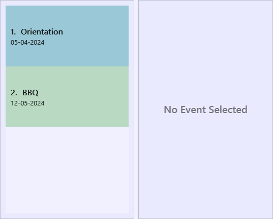
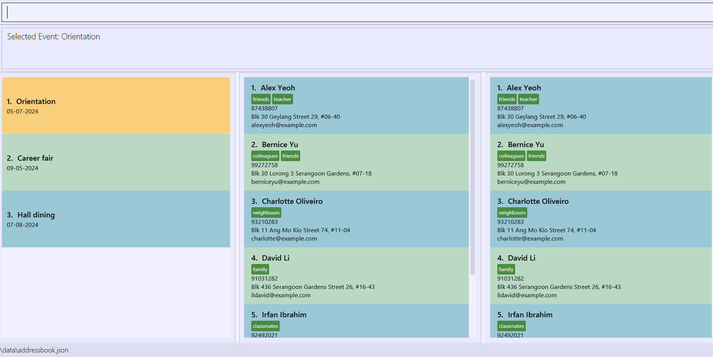
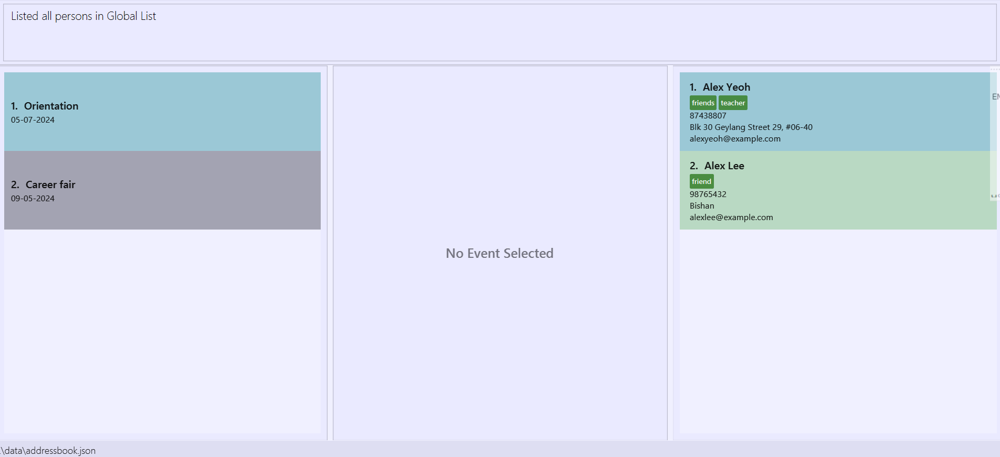
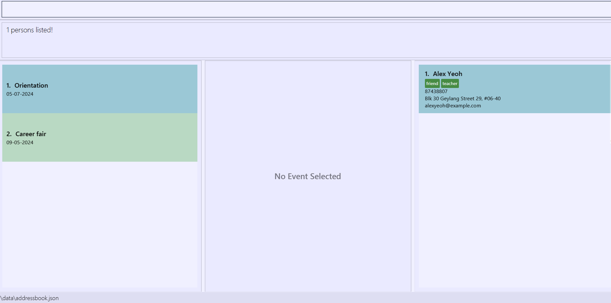

# Eventy User Guide

## Introduction

**Eventy** is a contact management application which offers a new standard of streamlined and automated contact organization.
Eventy is a combination of Command Line Interface(CLI) and Graphical User Interface(GUI), which entails both fast typing
and visual representation.

The application is **tailored specifically for student event organizers**, providing great benefits to event planning.
However, with the versatility and flexibility of the application, anyone can use it with ease.

**Bid farewell to troublesome event management** as Eventy will serve as your single source of truth
for storing, managing, planning and retrieving all contact-related information.

## Table of Contents
* [Introduction](#introduction)
* [Table of Contents](#table-of-contents)
* [1. Quick start](#1-quick-start)
* [2. UI Layout Description](#2-ui-layout-description)
* [3. Features](#3-features)
    * [3.1 Event Management](#3-1-event-management)
        * [3.1.1 Adding an event](#3-1-1-adding-an-event-addev)
        * [3.1.2 Editing an event](#3-1-2-editing-an-event-editev)
        * [3.1.3 Deleting an event](#3-1-3-deleting-an-event-delev)
        * [3.1.4 Selecting an event](#3-1-4-selecting-an-event-sel)
        * [3.1.5 Deselecting an event](#3-1-5-deselecting-an-event-desel)
    * [3.2 Contact Management](#3-2-contact-management)
        * [3.2.1 Adding person and their information to the global participant list](#3-2-1-adding-person-and-their-information-to-the-global-participant-list-addp)
        * [3.2.2 Inviting person to selected event](#3-2-2-inviting-person-to-selected-event-inv)
        * [3.2.3 Deleting a participant from the global participant list or an event participant list](#3-2-3-deleting-a-participant-from-the-global-participant-list-or-an-event-participant-list-delp)
        * [3.2.4 Editing existing participant](#3-2-4-editing-existing-participant-editp)
    * [3.3 Export function](#3-3-export-function)
        * [3.3.1 Exporting the chosen details of all the filtered persons to a CSV file](#3-3-1-exporting-the-chosen-details-of-all-the-filtered-persons-to-a-csv-file-export)
    * [3.4 Other commands](#3-4-other-commands)
        * [3.4.1 Clearing all entries](#3-4-1-clearing-all-entries-clear)
        * [3.4.2 Locating persons by name and/or tags](#3-4-2-locating-persons-by-name-and-or-tags-find)
        * [3.4.3 Viewing help](#3-4-3-viewing-help-help)
        * [3.4.4 Listing all persons](#3-4-4-listing-all-persons-list)
        * [3.4.5 Exiting the program](#3-4-5-exiting-the-program-exit)
* [4. FAQ](#4-faq)
* [5. Known issues](#5-known-issues)
* [6. Command summary](#6-command-summary)
* [7. Prefix translation table](#7-prefix-translation-table)

--------------------------------------------------------------------------------------------------------------------

## 1. Quick start

1. Ensure you have Java `11` or above installed in your Computer.

2. Download the latest `eventy.jar` from [here](https://github.com/AY2324S2-CS2103T-T10-3/tp/releases).

3. Copy the file to the folder you want to use as the _home folder_ for your Eventy.

4. Open a command terminal, `cd` into the folder you put the jar file in, and use the `java -jar eventy.jar` command to run the application. 
   A GUI similar to the below should appear in a few seconds. Note how the app contains some sample data. 
   

5. Refer to the [Features](#3-features) below for details of each command.

## 2. UI Layout Description

1. **Command Box:** Box for users to input the command to be executed by Eventy.
2. **Result Display Box:** Box that displays the result of executing the entered command.
3. **Event List:** Box that displays the all the events being planned.
4. **Event Participant List:** Box that displays all the participants in the selected event.
5. **Global Participant List:** Box that displays all the contacts saved.

--------------------------------------------------------------------------------------------------------------------

## 3. Features

<box type="info" seamless>

**Notes about the command format:**
* Words in `<UPPER_CASE>` are the parameters to be supplied by the user.
  e.g. in addp `n/<NAME>`, `<NAME>` is a parameter which can be used as `addp n/John Doe`.
* Items in square brackets are optional.
  e.g `n/<NAME> [t/<TAG>]` can be used as `n/John Doe t/friend` or as `n/John Doe`.
* Items with …​ after them can be used multiple times including zero times.
  e.g. `[t/<TAG>]…​` can be used as ` ` (i.e. 0 times), `t/friend`, `t/friend t/family` etc.
* Parameters can be in any order.
  e.g. if the command specifies `n/<NAME> p/<PHONE_NUMBER>`, `p/<PHONE_NUMBER> n/<NAME>` is also acceptable.
* Extraneous parameters for commands that do not take in parameters (such as `help`, `list`, `exit` and `clear`) will
  be ignored. e.g. if the command specifies `help 123`, it will be interpreted as `help`.
* It is recommended to keep **all inputs** below **64 characters** in length. Otherwise, the content may not be fully visible
  in the application window.
* If you are using a PDF version of this document, be careful when copying and pasting commands that span multiple lines
  as space characters surrounding line-breaks may be omitted when copied over to the application.

</box>

### 3.1 Event Management

#### 3.1.1 Adding an event: `addev`

Adds a new event with the specified name and date for the Event List.

**Format:** `addev ev/<EVENT NAME> d/<DATE>`

<box type="warning" seamless>

**Caution:**
* `<EVENT NAME>` should only contain **alphanumeric** characters and **spaces**, and be **non-empty**.
* `<DATE>` should be in the **dd-MM-yyyy** format. E.g.`29-08-2024`
* It is recommended to keep **all inputs** below **64 characters** in length. Otherwise, the content may not be fully visible
  in the application window.
* You **cannot** add an event with the same case-sensitive name and date as an event that already exists in Eventy.

</box>

**Examples:**
- `addev ev/Hall dining d/07-08-2024` adds a new event with the name `Hall Dining`, with the date August 7th, 2024.

Before `addev ev/Hall dining d/07-08-2024`:

After `addev ev/Hall dining d/07-08-2024`:

#### 3.1.2 Editing an event: `editev`

Edits an existing event based on index.

**Format:** `editev <EVENT INDEX> [ev/<EVENT NAME>] [d/<DATE>]`

<box type="warning" seamless>

**Caution:**
* At least one of the optional fields must be provided.
* Editing data fields with the same input is **allowed**.
* `<EVENT INDEX>` should be **non-empty**, a **positive integer** no larger than the number of events in the event list.
* `<EVENT NAME>` should only contain **alphanumeric** characters and **spaces**, and be **non-empty**.
* `<DATE>` should be in **dd-MM-yyyy** format
* It is recommended to keep **all inputs** below **64 characters** in length. Otherwise, the content may not be fully visible
  in the application window.
* Events are **not** to be edited to have an `<EVENT NAME>` and `<DATE>` that matches another event with the
  same case-sensitive `<EVENT NAME>` and `<DATE>` to avoid duplicate events.

</box>

**Examples:**
- `editev 1 ev/Orientation camp` changes the event name of event indexed 1 to `Orientation camp`.
- `editev 3 d/08-09-2024` changes the event date of event indexed 3 to September 8th, 2024.
- `editev 7 ev/Party d/08-09-2024` changes the event name and date of event indexed 7 to Party and September 8th, 2024.

#### 3.1.3 Deleting an event: `delev`

Deletes an event and all its relevant information with its index in the event list.

**Format:** `delev <EVENT INDEX>`

<box type="warning" seamless>

**Caution:**
* `<EVENT INDEX>` should be **non-empty**, a **positive integer** no larger than the number of events in the event list.
* You cannot delete an event that is currently selected.

</box>

**Examples:**
- `delev 1` deletes the 1st event in the displayed list.

#### 3.1.4 Selecting an event: `sel`

Selects an event from the event list by the event index. This displays the persons involved with that event, and allows you to manage that event using other commands.

**Format:** `sel <EVENT INDEX>`

<box type="warning" seamless>

**Caution:**

* `<EVENT INDEX>` should be **non-empty** and a **positive integer** no larger than the number of events in the event list.

</box>

**Examples:**
- `sel 1` selects the 1st event.

Before `sel 1`:

After `sel 1`:

#### 3.1.5 Deselecting an event: `desel`

Deselects the selected event and returns to the global participant list.

**Format:** `desel`

**Examples:**
- After `select 3` which selects the event with index `3`, `desel` deselects the event indexed `3`.

### 3.2 Contact Management

#### 3.2.1 Adding person and their information to the global participant list: `addp`

Adds a new person to the app, allowing them to be added to an event later.

**Format:** `addp n/<PARTICIPANT NAME> p/<PHONE NUMBER> e/<EMAIL> a/<ADDRESS> [t/<TAGS>]...`

<box type="warning" seamless>

**Caution:**
* `<PARTICIPANT NAME>` should be **alphabetic** and **non-empty**.
* `<PHONE NUMBER>` should only contain **numbers**, and it should be **at least 3 digits long**.
* `<EMAIL>` should be of the format `local-part@domain` and adhere to the following constraints:
  * The local-part should only contain alphanumeric characters and these special characters, excluding the parentheses, (`+_.-`). The local-part may not start or end with any special characters.
  * This is followed by a '@' and then a domain name. The domain name is made up of domain labels separated by periods.
     - The domain name must:
       - end with a domain label at least 2 characters long
       - have each domain label start and end with alphanumeric characters
       - have each domain label consist of alphanumeric characters, separated only by hyphens, if any
* `<ADDRESS>` Addresses can take **any values**, and it should be **non-empty**.
* `<TAGS>` should be **alphanumeric**.
* It is recommended to keep **all inputs** below **64 characters** in length. Otherwise, the content may not be fully visible
  in the application window.
* Adding a person with the same **case-sensitive name** that already exists is **not allowed**.

</box>

**Examples:**
- `addp n/David p/98987676 e/david@example.com a/NUS t/student` adds a participant named `David`
  with the phone number `98987676` and email of `david@example.com` to the displayed contacts list.

#### 3.2.2 Inviting person to selected event: `inv`

Invite participants from the global participant list to the selected event.

**Format:** `inv <PARTICIPANT INDEX>`

<box type="warning" seamless>

**Caution:**
* `<PARTICIPANT INDEX>` should be **non-empty**, a **positive integer** no larger
  than the number of persons in the global participant list.
* Duplicate participants is **not allowed.**

</box>

**Examples:**
- `inv 5` Adds participant indexed 5 to selected event.

Before `inv 5`:

After `inv 5`:

#### 3.2.3 Deleting a participant from the global participant list or an event participant list: `delp`
- 
- If **no event is selected**, this deletes the person from only the **global participant list**, but the person will
  remain in all the events he/she will be taking or has taken part in.
- If **an event is selected**, this only removes the participant from the event by **his/her index in the
  event participant list**.

**Format:** `delp <PARTICIPANT INDEX>`

<box type="warning" seamless>

**Caution:**
* `<PARTICIPANT INDEX>` should be **non-empty** and a **positive integer**.
* A participant's `<PARTICIPANT INDEX>` in an event participant list can be **different** from that in the global
  participant list.
* `<PARTICIPANT INDEX>` should be no larger than the number of participants in the global participant list if no event
  is selected.
* `<PARTICIPANT INDEX>` should be no larger than the number of participants in the event participant list if an event
  is selected.
* Deleting a participant in the global participants list will not delete the same participant in
  all event participant list

</box>

**Examples:**
- When no event is selected, `delp 9` deletes the 9th participant from the global participant list only.
- `delp 9` after `sel 3` removes the 9th participant from the 3rd event's participant list.

#### 3.2.4 Editing existing participant: `editp`

Updates the contact information of a participant in the app.

**Format:** `editp <PARTICIPANT INDEX> [n/<PARTICIPANT NAME>] [p/<PHONE NUMBER>] [e/<EMAIL>] [a/<ADDRESS>] [t/<TAGS>]...`

<box type="warning" seamless>

**Caution:**
* Editing a participant in the global participant list will edit the same participant in all event participant lists.
* At least one of the optional fields must be provided.
* When editing tags, the existing tags of the person will be removed i.e adding of tags is not cumulative
* You can remove all the person’s tags by typing t/ without specifying any tags after it.
* `<PARTICIPANT INDEX>` should be **non-empty**, a **positive integer** no larger than
  the number of participants in the global participant list.
* `<PARTICIPANT NAME>` should be **alphabetic** and **non-empty**.
* `<PHONE NUMBER>` should only contain **numbers**, and it should be **at least 3 digits long**.
* `<EMAIL>` should be of the format `local-part@domain` and adhere to the following constraints:
  * The local-part should only contain alphanumeric characters and these special characters, excluding the parentheses, (`+_.-`). The local-part may not start or end with any special characters.
  * This is followed by a '@' and then a domain name. The domain name is made up of domain labels separated by periods.
     - The domain name must:
       - end with a domain label at least 2 characters long
       - have each domain label start and end with alphanumeric characters
       - have each domain label consist of alphanumeric characters, separated only by hyphens, if any
* `<ADDRESS>` Addresses can take **any values**, and it should be **non-empty**.
* `<TAGS>` should be **alphanumeric**.
    * You can remove all the person's tags by typing `t/` without any tags after it.
* It is recommended to keep **all inputs** below **64 characters** in length. Otherwise, the content may not be fully visible
  in the application window.
* Adding a person with the same **case-sensitive name** that already exists is **not allowed**.

</box>

**Examples:**
- `editp 5 n/Max p/00000000 e/test@gmail.com` Edits contact details of participant indexed 5.

### 3.3 Export function

#### 3.3.1 Exporting the chosen details of all the filtered persons to a CSV file: `export`

Exports only the chosen details of all filtered persons to a CSV file. Currently, the command only supports the export
of name, phone, email and address. The command will not support the export of tags due to privacy concerns and rare
usage. The exported information will be in the file `exported_participant_data.csv`.

**Format:** `export [n/] [p/] [e/] [a/]`

<box type="warning" seamless>

**Caution:**
* At least one of the optional fields must be provided.
* `n/ p/ e/ a/` provided should be in **prefix**.
* `Prefix` only recognizes the four prefixes written above. Any other unknown prefixes will be disregarded.
* If the list to be exported is empty, the `exported_participant_data.csv` file will only contain headers to show that
  an empty export has been performed successfully.
* Make sure the `.csv` file is opened using the Notepad app or the equivalent. Using Microsoft Excel to open the `.csv`
  file will cause unexpected behaviors due to Excel interpreting certain fields as numbers. For example, Excel will
  recognize the phone number `00000000` as `0`.
* Another `export` will overwrite the file created by the previous `export`, so make sure to save the old
  `exported_participant_data.csv` somewhere else before doing another `export`.
* Do not have the `exported_participant_data.csv` file opened while exporting, as this will cause Eventy to be unable to
  overwrite the file.

</box>

**Examples:**
* `export n/` exports only the names of all the filtered persons.
* `export n/ p/` exports only the names and phone numbers of all the filtered persons.
* `export n/ p/ e/` exports only the names, phone numbers and emails of all the filtered persons.
* `export n/ p/ e/ a/` exports the names, phone numbers, emails and addresses of all the filtered persons.

### 3.4 Other commands

#### 3.4.1 Clearing all entries: `clear`

Clears all entries from the address book.

**Format:** `clear`

<box type="warning" seamless>

**Caution:**
* This deletes all entries!! Be careful!!

</box>

#### 3.4.2 Locating persons by name and/or tags: `find`

Locates persons by their names and/or tags, where
- If **no event is selected**, the search only includes persons from the **global participant list**.
- If **an event is selected**, the search only includes persons from the **event participant list**.

* When searching only using **names**:
    - Persons who have at least one of the specified names will be returned (i.e. OR search) e.g. `find n/Hans Bo` will return `Hans Gruber`, `Bo Yang`.
* When searching only using **tags**:
    * Persons must have all the specified tags to be returned (AND search) e.g. `find t/friend t/family` will return a person with tags of `friend`, `family`, and `neighbour`, but not a person with only the tag of `friend`.
* When searching using both **names and tags**:
    * Persons must match both the name and tag criteria to be returned. `find n/Hans t/friend` will return a person with name `Hans Gruber` with a tag of `friend`, but it will not return a person with name `Hans Bo`, without a tag of `friend` or a person with name `Bo Yang`, with a tag of `friend`.

**Format:**: `find [n/<NAME> <MORE_NAMES>] [t/<TAG>] [t/<MORE_TAGS>]`

<box type="warning" seamless>

**Caution:**

* At least one optional field should be provided.
* `<NAME>`should be **non-empty**, if provided e.g. `find n/` is not allowed.
* `<TAG>` should be **alphanumeric** and **non-empty**, if provided e.g. `find t/friend!$` and `find t/` are not allowed.
* The search by `<NAME>` is case-insensitive e.g. `hans` will match `Hans`.
* The search by `<TAG>` is case-sensitive e.g. `friend` will not match `Friend`.
* The order of the name/tag does not matter e.g. `Hans Bo` is equivalent to `Bo Hans`.
* Only full words will be matched for both names and tags e.g. `han` will not match `hans`.

</box>

**Examples:**
* `find n/John` returns `john` and `John Doe`.
* `find n/alex li` returns `Alex Yeoh`, `David Li`.
* `find t/friend` returns `john` and `David`, who both have the `friend` tag.
* `find t/friend t/collegues`  returns `john`, who has the `friend` and `colleagues` tags.
* `find t/friend t/collegues`  returns `tom`, who has the `friend`, `coworker` and `colleagues` tags.
* `find n/Alex t/friend t/teacher`  returns `Alex Yeoh`, who has the `friend` and `teacher` tags, but not `Alex Lee` who only has the `friend` tag. 

Before `find n/Alex t/friend t/teacher`:

After `find n/Alex t/friend t/teacher`:

#### 3.4.3 Viewing help: `help`

Shows a message explaining how to access the help page.

**Format:** `help`

#### 3.4.4 Listing all persons: `list`

- If **no event is selected**, this shows a list of all persons in the **global participant list**.
- If **an event is selected**, this shows a list of all persons in the **event participant list**.

**Format:** `list`

#### 3.4.5 Exiting the program: `exit`

Exits the program.

**Format:** `exit`

--------------------------------------------------------------------------------------------------------------------

## 4. FAQ

**Q**: How do I transfer my data to another Computer? 
**A**: Install the app in the other computer and overwrite the empty data file it creates with the file that contains the data of your previous AddressBook home folder.

--------------------------------------------------------------------------------------------------------------------

## 5. Known issues

1. **When using multiple screens**, if you move the application to a secondary screen, and later switch to using only the primary screen, the GUI will open off-screen. The remedy is to delete the `preferences.json` file created by the application before running the application again.

--------------------------------------------------------------------------------------------------------------------

## 6. Command summary

| Action                                      | Format, Examples                                                                                                      |
|---------------------------------------------|-----------------------------------------------------------------------------------------------------------------------|
| **Add Event**                               | `addev ev/<event name> d/<date>`   e.g., `addev ev/Hall dining d/07-08-2024`                                  |
| **Edit Event**                              | `editev INDEX ev/<event name> d/<date>`   e.g., `editev 1 ev/Party`                                                |
| **Delete Event**                            | `delev <index>`   e.g., `delev 1`                                                                                  |
| **Add Participant**                         | `addp n/<participant name> p/<phone number> e/<email> a/<address> t/<tags>`   e.g., `addp n/David p/98987676 e/david@example.com a/NUS t/friends` |
| **Selecting Event**                         | `sel <event index>`   e.g., `sel                                                                                   |
| **Deselecting Event**                       | `desel` deselects the current selected event                                                                           |
| **Deleting a participant from global list** | `delp <index>` deletes the participant of the provided index from the global participant list                                                  |
| **Deleting a participant from an event**    | `delp <index>` deletes the participant of the provided index from the event participant list                                                 |
| **Edit existing participant**               | `editp <index> n/<participant name> p/<phone number> e/<email> a/<address> t/<tags>` edits contact details of a participant at the provided index          |
| **Invite person to a selected event**       | `inv <index>` adds participant at the provided index to selected event                                                                  |
| **Locating persons by name/tag**            | `find n/<participant name> t/<tags>` returns the person matching the name and tag                                                                                |
| **Clear all entries**                       | `clear` clears all entries from eventy                                                                                 |
| **Viewing help**                            | `help` shows a message explaining how to access the help page                                                         |
| **Listing all persons**                     | `list` shows a list of all persons in the address book.                                                               |
| **Exiting the program**                     | `exit` exits the program                                                                                              |

## 7. Prefix translation table

|Prefix |Translation   |
|-------|--------------|
|n/     |Name          |
|p/     |Phone number  |
|e/     |Email         |
|a/     |Address       |
|t/     |Tags          |
|ev/    |Event name    |
|d/     |Event date    |
