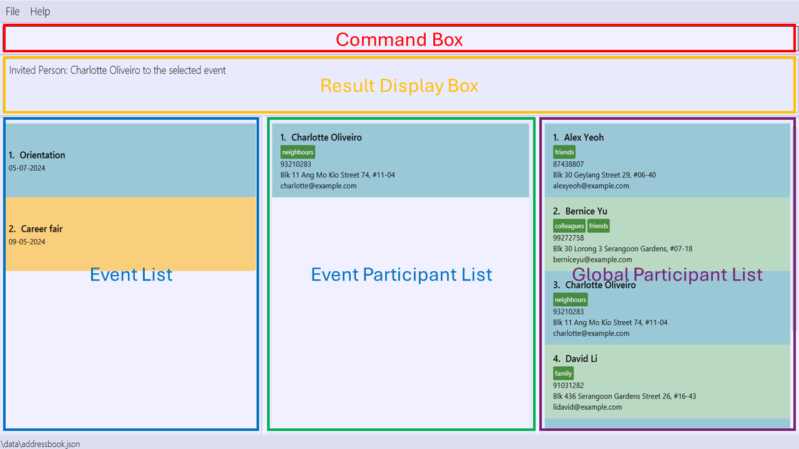
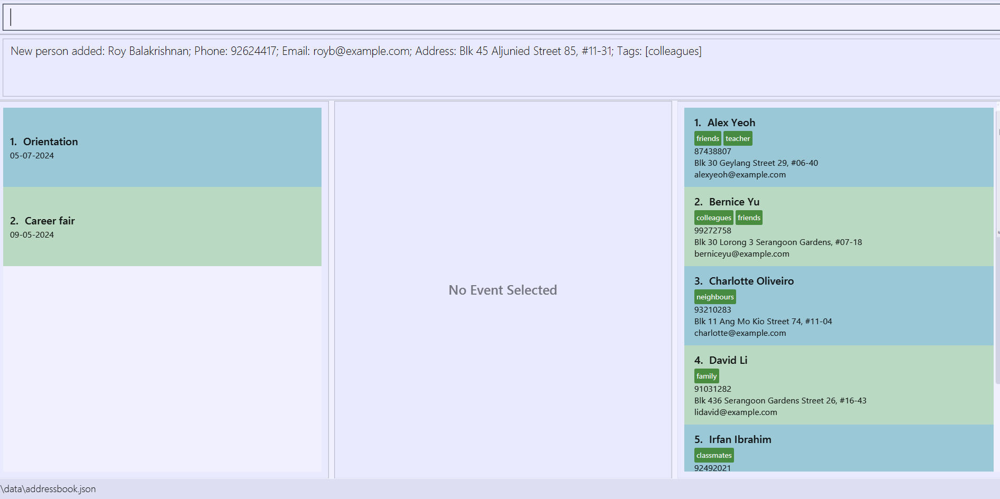
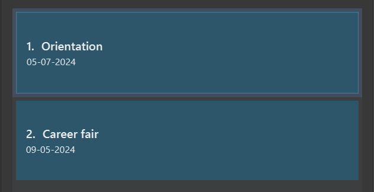
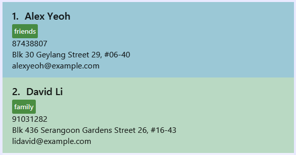

# Eventy User Guide

"Eventy", a contact management application tailored specifically for student event organizers, offers a new standard of streamlined and automated contact organization. It serves as your single source of truth for storing, managing, and retrieving all contact-related information.

<!-- * Table of Contents -->
<page-nav-print />

--------------------------------------------------------------------------------------------------------------------

## Quick start

1. Ensure you have Java `11` or above installed in your Computer.

2. Download the latest `eventy.jar` from [here](https://github.com/AY2324S2-CS2103T-T10-3/tp/releases).

3. Copy the file to the folder you want to use as the _home folder_ for your Eventy.

4. Open a command terminal, `cd` into the folder you put the jar file in, and use the `java -jar eventy.jar` command to run the application. 
   A GUI similar to the below should appear in a few seconds. Note how the app contains some sample data. 
   

5. Refer to the [Features](#features) below for details of each command.

## UI Layout Description

1. **Command Box:** Box for users to input the command to be executed by Eventy.
2. **Result Display Box:** Box that displays the result of executing the entered command.
3. **Event List:** Box that displays the all the events being planned.
4. **Event Participant List:** Box that displays all the participants in the selected event.
5. **Global Participant List:** Box that displays all the contacts saved.

--------------------------------------------------------------------------------------------------------------------

## Features

### Creating an event: `addev`

**Format:** `addev ev/<event name> d/<date>`

**Description:**

Adds a new event with the specified name and date for the Event List.

<box type="warning" seamless>

**Caution:**
* `<event name>` should be **alphanumeric**, **non-empty** and **not longer than 64 characters**.
* `<date>` should be in **dd-MM-yyyy** format
* Adding an event with a name and date that already exists, regardless of case, is **not allowed.**
  </box>

**Examples:**
- `addev ev/Orientation camp d/04-05-2024` adds a new event with the name `Orientation camp` that will happen on May 4th, 2024.
  
Before:

After:

### Editing an event: `editev`

**Format:** `editev <event index> ev/<event name> d/<date>`

**Description:**

Edits an existing event based on index.

<box type="warning" seamless>

**Caution:**
* `<event index` should be **non-empty**, a **positive integer** no larger than the number of events in the event list.
At least one of `<event name>` and `<date>` should not be null.
* `<event name>` should be **alphanumeric**, **non-empty** and **not longer than 64 characters**.
* `<date>` should be in **dd-MM-yyyy** format
* Events are **not** to be edited with `<date>` and `<event name>` that matches with another event containing the
  same `<date>` and `<event name>` to avoid any confusion.
   </box>

**Examples:**
- `editev 1 ev/Orientation camp` changes the event name of event indexed 1 to `Orientation camp`.
- `editev 1 d/08-09-2024` changes the event date of event indexed 1 to September 8th, 2024.
- `editev 1 ev/Party d/08-09-2024` changes the event name and date of event indexed 1 to Party and September 8th, 2024.

### Deleting an event: `delev`

**Format:** `delev <event index>`

**Description:**

Deletes an event and all its relevant information with its index in the event list.

<box type="warning" seamless>

**Caution:**
* `<event index>` should be **non-empty**, a **positive integer** no larger than the number of events in the event list.
* You cannot delete an event that is currently selected. 
  </box>

**Examples:**
- `delev 1` deletes the 1st event in the displayed list.

### Selecting an event: `sel`

**Format:** `sel <event index>`

**Description:**

Selects an event from the event list by the event index.

<box type="warning" seamless>

**Caution:**
* `<event index>` should be **non-empty**, a **positive integer** no larger than the number of events in the event list.
</box>

**Examples:**
- `sel 3` selects the 3rd event.

Before:

After:

### Deselecting an event: `desel`

**Format:** `desel`

**Description:**

Deselects the selected event and returns to the global participant list.

**Examples:**
- After `select 3` which selects the event with index `3`, `desel` deselects the event indexed `3`.

### Adding person and their information to the global participant list: `addp`

**Format:** `addp n/<participant name> p/<phone number> e/<email> a/<address> t/<tags>`

**Description:**

Adds a new person to the app, allowing them to be added to an event later.

<box type="warning" seamless>

**Caution:**
* `<participant name>` should be **alphabetic**, **non-empty** and **not longer than 64 characters**.
* `<phone number>` should be **numeric**, **non-empty**, **be at least 3 digits** and **not longer than 15 digits**.
* `<email>` should be **alphanumeric**, **non-empty** and **not longer than 64 characters**.
* `<address>` should be **non-empty** and **not longer than 64 characters**.
* `<tag>` should be **alphabetic**.
* Adding a person with the same **name**(Case-sensitive) that already exists, regardless of case, is **not allowed**.  
  </box>

**Examples:**
- `addp n/David p/98987676 e/david@example.com a/NUS t/student` adds a participant named `David`
  with the phone number `98987676` and email of `david@example.com` to the displayed contacts list.

### Inviting person to selected event: `inv`

**Format:** `inv <participant index>`

**Description:**

Invite participants from the global participant list to the selected event.

<box type="warning" seamless>

**Caution:**
* `<participant index>` should be **non-empty**, a **positive integer** no larger
  than the number of persons in the global participant list.
* Duplicate participants is **not allowed.**
  </box>

**Examples:**
- `inv 5` Adds participant indexed 5 to selected event.

Before:

After:

### Deleting a participant from the global participant list or an event participant list: `delp`

**Format:** `delp <participant index>`

**Description:**

- If **no event is selected**, this deletes the person from both the **global participant list**.
- If **an event is selected**, this only removes the participant from the event by **his/her index in the
  event participant list**.

<box type="warning" seamless>

**Caution:**
* `<participant index>` should be **non-empty** and a **positive integer**.
* A participant's `<participant index>` in an event participant list can be **different** from that in the global
  participant list.
* `<participant index>` should be no larger than the number of participants in the global participant list if no event
  is selected.
* `<participant index>` should be no larger than the number of participants in the event participant list if an event
  is selected.
* Deleting a participant in the global participants list will not delete the same participant in 
  all event participant list
</box>

**Examples:**
- When no event is selected, `delp 9` deletes the 9th participant from the global participant list only.
- `delp 9` after `sel 3` removes the 9th participant from the 3rd event's participant list.

### Editing existing participant: `editp`

**Format:** `editp <participant index> n/<participant name> p/<phone number> e/<email> a/<address> t/<tags>`

**Description:**

Updates the contact information of a participant in the app.

<box type="warning" seamless>

**Caution:**
* Editing a participant in the global participant list will edit the same participant in all event participant lists.
* At least one of the optional fields must be provided.
* When editing tags, the existing tags of the person will be removed i.e adding of tags is not cumulative
* You can remove all the person’s tags by typing t/ without specifying any tags after it.
* `<participant index>` should be **non-empty**, a **positive integer** no larger than 
  the number of participants in the global participant list.
* `<participant name>` should be **alphabetic**, **non-empty** and **not longer than 64 characters**.
* `<phone number>` should be **numeric**, **non-empty** and **not longer than 15 digits**.
* `<email>` should be **alphanumeric**, **non-empty** and **not longer than 64 characters**.
* `<address>` should be **non-empty** and **not longer than 64 characters**.
  </box>
  
**Examples:**
- `editp 5 n/Max p/00000000 e/test@gmail.com` Edits contact details of participant indexed 5.

### Exporting the chosen details of all the filtered persons to a CSV file.

**Format:** `export n/ p/ e/ a/`

**Description:**

Exports only the chosen details of all filtered persons to a CSV file.

<box type="warning" seamless>

**Caution:**
* At least one of the optional fields must be provided.
* `n/ p/ e/ a/` provided should be in **prefix**.
* `Prefix` only recognize the four prefixes written above. Do not input any other unknown prefixes.
  </box>
  
**Examples:**
* `export n/` exports only the names of all the filtered persons.
* `export n/ p/` exports only the names and phone numbers of all the filtered persons.
* `export n/ p/ e/` exports only the names, phone numbers and emails of all the filtered persons.
* `export n/ p/ e/ a/` exports the names, phone numbers, emails and addresses of all the filtered persons.

### Clearing all entries : `clear`

**Format:** `clear`

**Description:**

Clears all entries from the address book.

**Caution:**
* This deletes all entries!! Be careful!!
  </box>

### Locating persons by name: `find`

**Format:**
1. `find n/KEYWORD [MORE_KEYWORDS]`
2. `find t/KEYWORD t/[MORE_KEYWORDS]`
3. `find n/KEYWORD [MORE_KEYWORDS] t/KEYWORD t/[MORE_KEYWORDS]`

**Description:**
- If **no event is selected**, this finds the person by their names or/and tags from the **global participant list**.
- If **an event is selected**, this finds the person by their names or/and tags from the **event participant list**.

* The search by name is case-insensitive. e.g. `hans` will match `Hans`
* The search by tag is case-sensitive. e.g. `friends` will not match `Friends`
* The order of the name/tag does not matter. e.g. `Hans Bo` will match `Bo Hans`
* Only full names/tags will be matched e.g. `Han` will not match `Hans`
* **Format 1:** Persons matching at least one name will be returned (i.e. `OR` search).
  e.g. `Hans Bo` will return `Hans Gruber`, `Bo Yang`
  
* **Format 2:** 
  1. For find with one tag given, all persons with the tags will be returned (i.e. `OR` search).
  2. For find with multiple tags given, person matching all tags will be returned (i.e. `AND` search).
* **Format 3:** Person matching the name and tags will be returned.

<box type="warning" seamless>

**Caution:**
* `<KEYWORD>` name should be **alphabetic**, **non-empty** and **not longer than 64 characters**.
* `<KEYWORD>` tag should be **alphabetic**, **non-empty** and **not longer than 64 characters**.
  </box>

**Examples:**
* `find n/John` returns `john` and `John Doe`
* `find n/alex david` returns `Alex Yeoh`, `David Li`
* `find t/friends` returns `john` and `David`, who contain `friends` tag.
* `find t/friends t/collegues`  returns `john`, who contains `friends` and `colleagues` tags.
* `find n/Alex t/friends t/teacher`  returns `Alex`, who contains `friends` and `teacher` tags. 
  

### Viewing help : `help`

**Format:** `help`

**Description:**

Shows a message explaining how to access the help page.

### Listing all persons : `list`

**Description:**

- If **no event is selected**, this shows a list of all persons in the **global participant list**.
- If **an event is selected**, this shows a list of all persons in the **event participant list**.

Format: `list`

### Exiting the program : `exit`

Exits the program.

Format: `exit`

--------------------------------------------------------------------------------------------------------------------

## FAQ

**Q**: How do I transfer my data to another Computer? 
**A**: Install the app in the other computer and overwrite the empty data file it creates with the file that contains the data of your previous AddressBook home folder.

--------------------------------------------------------------------------------------------------------------------

## Known issues

1. **When using multiple screens**, if you move the application to a secondary screen, and later switch to using only the primary screen, the GUI will open off-screen. The remedy is to delete the `preferences.json` file created by the application before running the application again.

--------------------------------------------------------------------------------------------------------------------

## Command summary

| Action                                      | Format, Examples                                                                                                      |
|---------------------------------------------|-----------------------------------------------------------------------------------------------------------------------|
| **Add Event**                               | `addev ev/<event name> d/<date>`   e.g., `addev ev/Orientation camp d/04-07-2024`                                  |
| **Edit Event**                              | `editev INDEX ev/<event name> d/<date>`   e.g., `editev 1 ev/Party`                                                |
| **Delete Event**                            | `delev <index>`   e.g., `delev 1`                                                                                  |
| **Add Participant**                         | `addp n<participant name> p/<phone number> e/<email> a/<address> t/<tags>`   e.g., `addp n/David p/98987676 e/david@example.com a/NUS t/friends` |
| **Selecting Event**                         | `sel <event index>`   e.g., `sel                                                                                   |
| **Deselecting Event**                       | `desel` deselect the current selected event                                                                           |
| **Deleting a participant from global list** | `delp 3` delete the 3rd participant from the global participant list                                                  |
| **Deleting a participant from an event**    | `delp 3` delete the 3rd participant from event list of selected event                                                 |
| **Edit existing participant**               | `editp 5 n/Max p/00000000 e/test@gmail.com a/NUS t/friends` Edits contact details of participant indexed 5            |
| **Invite person to a selected event**       | `inv 5` Adds participant indexed 5 to selected event                                                                  |
| **Locating persons by name/tag**            | `find n/John t/friends` returns `john`                                                                                |
| **Clear all entries**                       | `clear` clear all entries from eventy                                                                                 |
| **Viewing help**                            | `help` Shows a message explaining how to access the help page                                                         |
| **Listing all persons**                     | `list` Shows a list of all persons in the address book.                                                               |
| **Exiting the program**                     | `exit` Exits the program                                                                                              |

## Prefix translation table

|Prefix |Translation   |
|-------|--------------|
|n/     |Name          |
|p/     |Phone number  |
|e/     |Email         |
|a/     |Address       |
|t/     |Tags          |
|ev/    |Event name    |
|d/     |Event date    |
